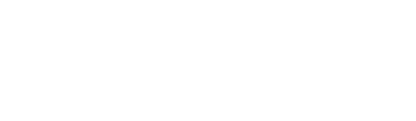

<p align="center">
  
</p>

<p align="center">
  
</p>

<p align="center">
  Turn Coding Agents into autonomous knowledge workers.
</p>

<p align="center">
  <a href="https://nightshift.sh">Website</a> &middot;
  <a href="https://docs.nightshift.sh">Docs</a> &middot;
  <a href="https://join.slack.com/t/nightshiftoss/shared_invite/zt-3p5dshiiq-hjB8558QvURDgqqCI7e8RQ">Slack</a>
</p>

---

Nightshift is a CLI that takes Coding Agents like [OpenCode](https://opencode.ai/), [Claude Code](https://code.claude.com/docs/en/overview), and [Codex](https://developers.openai.com/codex/cli/) and turns them into autonomous problem solvers that can complete complex, long-running knowledge work tasks.

> Nightshift is in early development and subject to change. If you find a bug or have an idea, please [open an issue](https://github.com/nightshiftco/nightshift/issues).

## Features

- **Isolated environments** — Each agent runs in its own prefix directory with pinned tools, a managed Python installation, XDG isolation, and a lightweight sandbox. Nothing touches your host system.
- **Autonomous execution** — The Ralph loop pairs a worker agent with a boss agent. The worker codes, the boss evaluates, and the loop continues until the task is done.
- **Concurrent task isolation** — Worktrees give each task its own git branch and working directory so multiple tasks can run in parallel without conflicts.
- **Reproducibility** — Every tool version is pinned. Every environment is built from scratch. The same install command produces the same result on any machine.

## Installation

### Download the binary

```bash
curl https://nightshift.sh/install | sh
```

### Build from source

Nightshift is a [Bun](https://bun.sh/) project that compiles to a single binary.

```bash
git clone git@github.com:nightshiftco/nightshift.git
cd nightshift
bun install
bun run build:single
```

The binary will be output to `dist/nightshift-<os>-<arch>/bin/nightshift`.

## Quickstart

```bash
# Install the toolchain into an isolated prefix
nightshift install --prefix ~/my-agent

# Launch OpenCode with the prefix as the working directory
nightshift run

# Run the autonomous Ralph loop from a prompt file
nightshift run --ralph --prompt task.txt

# Start the Ralph HTTP server
nightshift run --ralph serve --serve-port 3000

# Ralph server with the Jobs TUI
nightshift run --ralph serve --run-nightshift-tui
```

## How it works

`nightshift install` downloads OpenCode, uv, ripgrep, and ty into a self-contained prefix directory, scaffolds a Python workspace with common data science packages, and initializes a git repo — everything the agent needs to start working.

`nightshift run` launches the agent inside that isolated environment with its own `PATH`, XDG directories, and optional sandbox.

`nightshift run --ralph` activates the Ralph loop: a **worker** agent executes the task, a **boss** agent evaluates the output, and the cycle repeats until the boss approves or the iteration limit is reached.

## Documentation

Full documentation is available at [docs.nightshift.sh](https://docs.nightshift.sh):

- [Installation](https://docs.nightshift.sh/installation) — Download or build from source
- [Install command](https://docs.nightshift.sh/install) — How the prefix environment is set up
- [Ralph Loop](https://docs.nightshift.sh/ralph-loop) — Autonomous worker/boss execution
- [Worktrees](https://docs.nightshift.sh/worktrees) — Concurrent task isolation with git worktrees
- [Sandbox](https://docs.nightshift.sh/sandbox) — Read-only host filesystem protection
- [Ralph Server](https://docs.nightshift.sh/system/ralph-server) — HTTP API for submitting tasks
- [Contributing](https://docs.nightshift.sh/contributing) — How to contribute

## License

See [LICENSE](LICENSE) for details.
